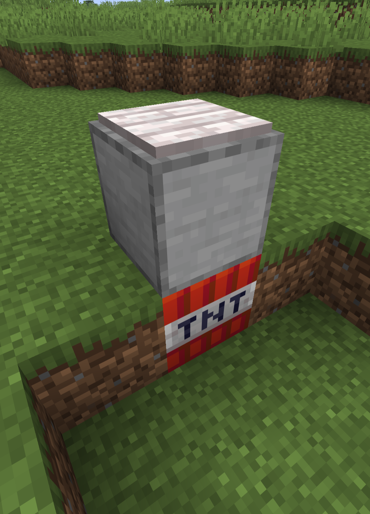
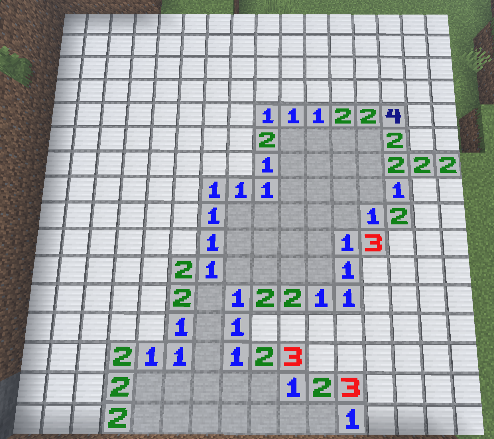
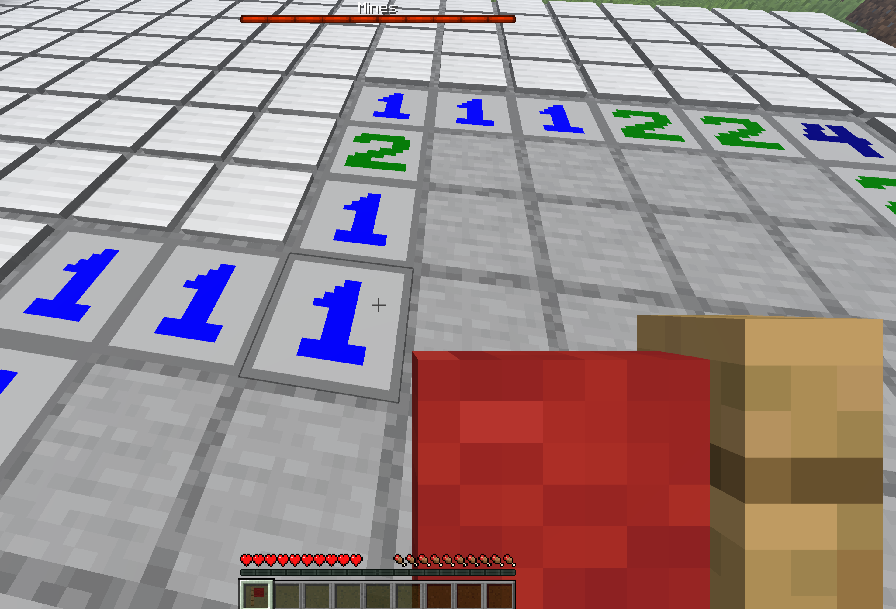
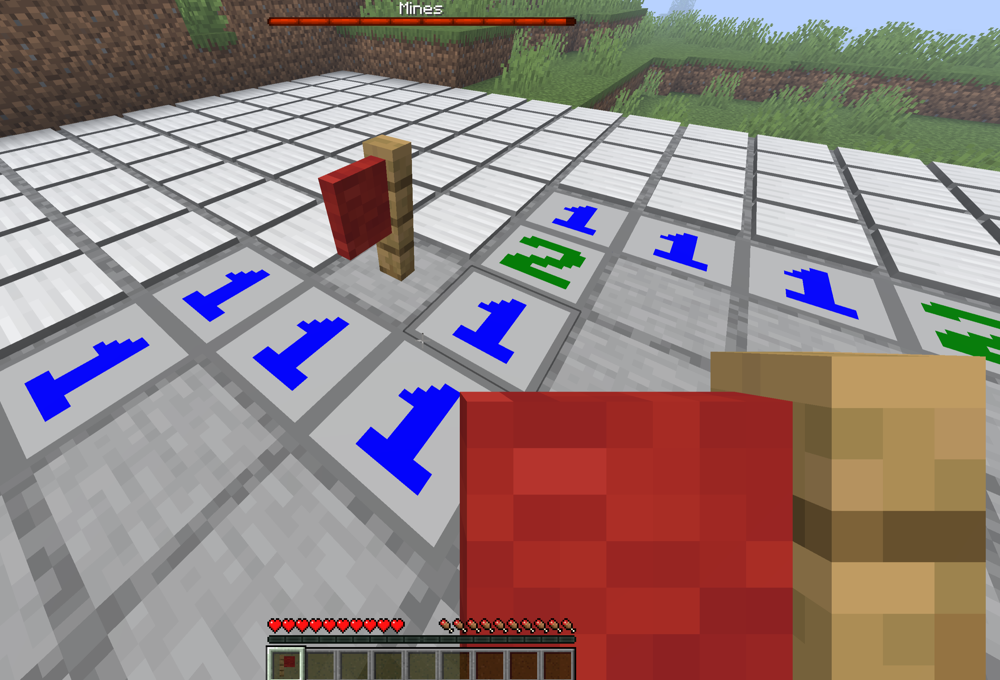
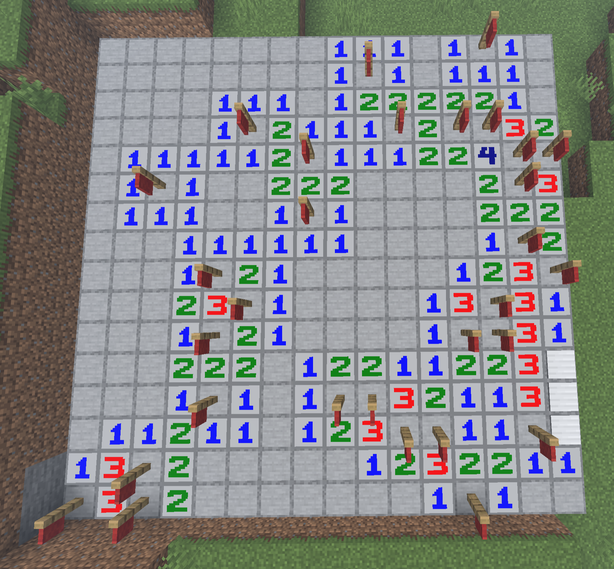

# Minesweeper in Minecraft

This PaperMC Plugin allows to play Minesweeper in Minecraft.

The game is launched by creating a structure as seen in the first screenshot.
The bottom block is ***TNT***, the middle one is ***Smooth Stone*** and the top one has to be
a ***Heavy Weighted Pressure Plate*** (an Iron Pressure Plate).

  <!--suppress CheckImageSize -->
  

That then spawns a field...

  <!--suppress CheckImageSize -->
  

You can interact with the field by moving onto a pressure plate and
by either dropping (preferred) or placing the flag that you have received
upon game creation onto a pressure plate.
Whenever you place a flag, the boss bar goes down, indicating how many mines
still remain.
Notably, the bar goes down regardless of whether you correctly flagged the location.

  <!--suppress CheckImageSize -->
  
  <!--suppress CheckImageSize -->
  

Lastly, the game automatically ends whenever you have either flagged all mines
or if you have uncovered all non-mines.

  <!--suppress CheckImageSize -->
  

